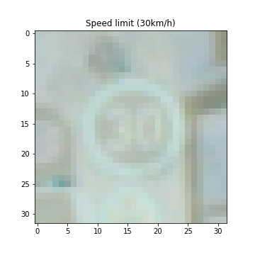
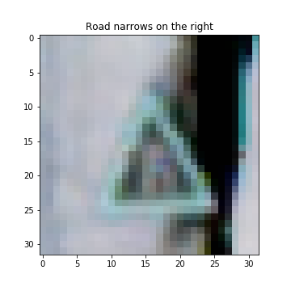
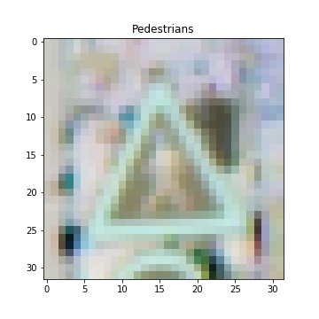
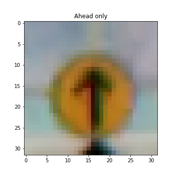

# **Traffic Sign Recognition** 

## Writeup

**Build a Traffic Sign Recognition Project**

The goals / steps of this project are the following:
* Load the data set
* Explore, summarize and visualize the data set
* Design, train and test a model architecture
* Use the model to make predictions on new images
* Analyze the softmax probabilities of the new images
* Summarize the results with a written report

## Rubric Points
### Here I will consider the [rubric points](https://review.udacity.com/#!/rubrics/481/view) individually and describe how I addressed each point in my implementation.  

---
### Writeup / README

#### 1. Provide a Writeup / README that includes all the rubric points and how you addressed each one. You can submit your writeup as markdown or pdf. You can use this template as a guide for writing the report. The submission includes the project code.

Link to my [project code](https://github.com/tyleryoo/trafficSignClassifier/blob/master/Traffic_Sign_Classifier.ipynb)

### Data Set Summary & Exploration

#### 1. Provide a basic summary of the data set. In the code, the analysis should be done using python, numpy and/or pandas methods rather than hardcoding results manually.

I used the pandas library to calculate summary statistics of the traffic
signs data set:

* The size of training set is 34,799
* The size of the validation set is 4,410
* The size of test set is 12,630
* The shape of a traffic sign image is (32, 32, 3)
* The number of unique classes/labels in the data set is 43

#### 2. Include an exploratory visualization of the dataset.

Here is an exploratory visualization of the data set. The first section shows bar chart describing the size of each sample in the training set. And the second one shows the image representation of the first item of each sample in the training set.

* Training Set Bar Chart

* First Item of Each Class in the training set

  
  
  
  
  
  
  
  
  
  
  
  
  
  
  
  
  
  
  
  
  
  
  
  
  
  
  
  
  
  
  
  
  
  
  
  
  
  
  
  
  
  
  

### Design and Test a Model Architecture

#### 1. Describe how you preprocessed the image data. What techniques were chosen and why did you choose these techniques? Consider including images showing the output of each preprocessing technique. Pre-processing refers to techniques such as converting to grayscale, normalization, etc. (OPTIONAL: As described in the "Stand Out Suggestions" part of the rubric, if you generated additional data for training, describe why you decided to generate additional data, how you generated the data, and provide example images of the additional data. Then describe the characteristics of the augmented training set like number of images in the set, number of images for each class, etc.)

I normalized all the image layers using sklearn.preprocessing.normailize. Because color information does help to classify the signs.
Here is an example of a traffic sign image before and after normalizing.

#### 2. Describe what your final model architecture looks like including model type, layers, layer sizes, connectivity, etc.) Consider including a diagram and/or table describing the final model.

My final model consisted of the following layers:

| Layer | Description | 
|:---------------------:|:---------------------------------------------:| 
| Input | 32x32x3 RGB image | 
| Convolution 5x5#1   | 1x1 stride, valid padding, outputs 28x28x30    |
| RELU | |
| Max pooling  #1 | 2x2 stride,  outputs 14x14x30 |
| Convolution 5x5#2  | 1x1 stride, valid padding, outputs 10x10x60 
| RELU | |
| Max pooling #2 | 2x2 stride,  outputs 5x5x60 |
| Flatten | |
| Fully connected#1  | input 1500, output 600 |
| RELU | |
| Fully connected#2  | input 600, ouput 300 |
| RELU | |
| Fully connected#3  | input 300, output 100|
| RELU | |
| Fully connected#4  | Input 100, output 43 |

#### 3. Describe how you trained your model. The discussion can include the type of optimizer, the batch size, number of epochs and any hyperparameters such as learning rate.

To train the model, Basically I used an Lenet model explained in the course.

#### 4. Describe the approach taken for finding a solution and getting the validation set accuracy to be at least 0.93. Include in the discussion the results on the training, validation and test sets and where in the code these were calculated. Your approach may have been an iterative process, in which case, outline the steps you took to get to the final solution and why you chose those steps. Perhaps your solution involved an already well known implementation or architecture. In this case, discuss why you think the architecture is suitable for the current problem.

My final model results were:
* training set accuracy of 99.8%
* validation set accuracy of 93.6%
* test set accuracy of 93.08% 
 .validation set accuracy and test set accuracy suffice the condition of the project rubric.

A well known model apdapted:
* What was the first architecture that was tried and why was it chosen? 
 .Lenet Model

* What were some problems with the initial architecture? 
 .The training time cost much and the final result was unsatisfactory (less than 90%)

* How was the architecture adjusted and why was it adjusted? Typical adjustments could include choosing a different model architecture, adding or taking away layers (pooling, dropout, convolution, etc), using an activation function or changing the activation function. One common justification for adjusting an architecture would be due to overfitting or underfitting. A high accuracy on the training set but low accuracy on the validation set indicates over fitting; a low accuracy on both sets indicates under fitting.
 .Used the default Lenet model, but there was some room for enhancement. I increased the Covnet layers' parameter size and added max pooling layers, and added more fully connected layer and then could meet the goal(93% for valid. set)

* Which parameters were tuned? How were they adjusted and why?  
 .the number of layer and weight parameters  
 .increase the batch size (from 128 to 256)  
 .decrease the learning rate (from 0.01 to 0.005)

* What are some of the important design choices and why were they chosen? For example, why might a convolution layer work well with this problem? How might a dropout layer help with creating a successful model?  
 .Applied many big layers to the default Lenet model  
 .Convolution layer work well with image recognition, because CNN recognizes simple objects and then increasingly recognizes more complex objects just like the way humans recognize images.  
 .Stacked lots of  covnets, activation layer, pooling layer, fully connected layers.  
 .Tried a couple of dropout layers but didn't make any meaningful difference, so i 'dropped' dropout layers.  

### Test a Model on New Images

#### 1. Choose five German traffic signs found on the web and provide them in the report. For each image, discuss what quality or qualities might be difficult to classify.

Here are five German traffic signs that I found on the web:

  
  
  
  
  

The second image looks difficult because it has watermark in the middle and might also be confused with 'speed limit 80'
Other images look fine.

#### 2. Discuss the model's predictions on these new traffic signs and compare the results to predicting on the test set. At a minimum, discuss what the predictions were, the accuracy on these new predictions, and compare the accuracy to the accuracy on the test set.

Here are the results of the prediction:

['Roundabout mandatory', 'Speed limit (50km/h)', 'Speed limit (60km/h)', 'Stop', 'Turn right ahead']

| Image                 |     Prediction                                | 
|:---------------------:|:---------------------------------------------:| 
| Roundabout mandatory | Roundabout mandatory | 
| Speed limit (50km/h) | Speed limit (50km/h) |
| Speed limit (60km/h)| Speed limit (60km/h)|
| Stop | Stop |
| Turn right ahead | Turn right ahead |

The model was able to correctly guess 5 of the 5 traffic signs, which gives an accuracy of 100%. 

#### 3. Describe how certain the model is when predicting on each of the five new images by looking at the softmax probabilities for each prediction. Provide the top 5 softmax probabilities for each image along with the sign type of each probability.

For the first image, the model prdedicted Roundabout mandatory with the probability of 0.15. The top five soft max probabilities were listed in the table below.

| Probability           |     Prediction                                | 
|:---------------------:|:---------------------------------------------:| 
| .15                   | Roundabout mandatory | 
| .11                   | Turn right ahead |
| .09                   | Ahead only |
| .08                   | Speed limit (70km/h) |
| .06                   | Keep left |

For the second image, the model prdedicted Speed limit (50km/h) with the probability of 0.28. The top five soft max probabilities were listed in the table below.

| Probability           |     Prediction                                | 
|:---------------------:|:---------------------------------------------:| 
| .28                   | Speed limit (50km/h) | 
| .20                   | Speed limit (80km/h) |
| .19                   | Speed limit (60km/h) |
| .09                   | Speed limit (100km/h) |
| .07                   | No passing |

For the thrid image, the model prdedicted Speed limit (60km/h) with the probability of 0.28. The top five soft max probabilities were listed in the table below.

| Probability           |     Prediction                                | 
|:---------------------:|:---------------------------------------------:| 
| .51                   | Speed limit (60km/h) | 
| .22                   | Speed limit (80km/h) |
| .15                   | No passing |
| .13                   | Speed limit (50km/h) |
| .12                   | End of all speed and passing limits |

For the fourth image, the model prdedicted Stop with the probability of 0.51. The top five soft max probabilities were listed in the table below.

| Probability           |     Prediction                                | 
|:---------------------:|:---------------------------------------------:| 
| .51                   | Stop | 
| .22                   | No entry |
| .15                   | Speed limit (100km/h) |
| .13                   | Speed limit (30km/h) |
| .12                   | Speed limit (70km/h) |

For the fifth image, the model prdedicted Turn right ahead with the probability of 0.32. The top five soft max probabilities were listed in the table below.

| Probability           |     Prediction                                | 
|:---------------------:|:---------------------------------------------:| 
| .32                   | Turn right ahead | 
| .23                   | Ahead only |
| .10                   | Right-of-way at the next intersection |
| .079                  | Traffic signals |
| .070                  | Speed limit (70km/h) |

